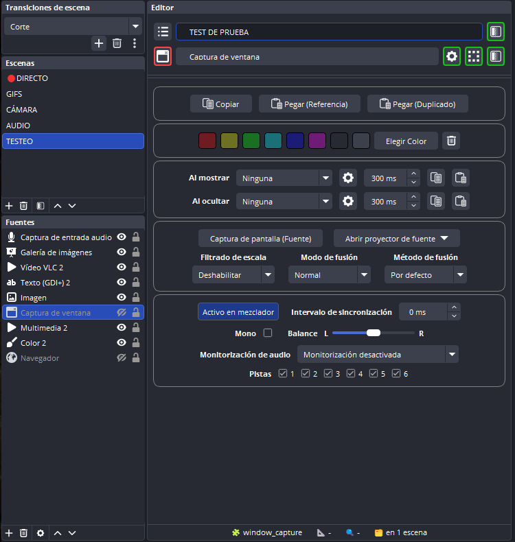
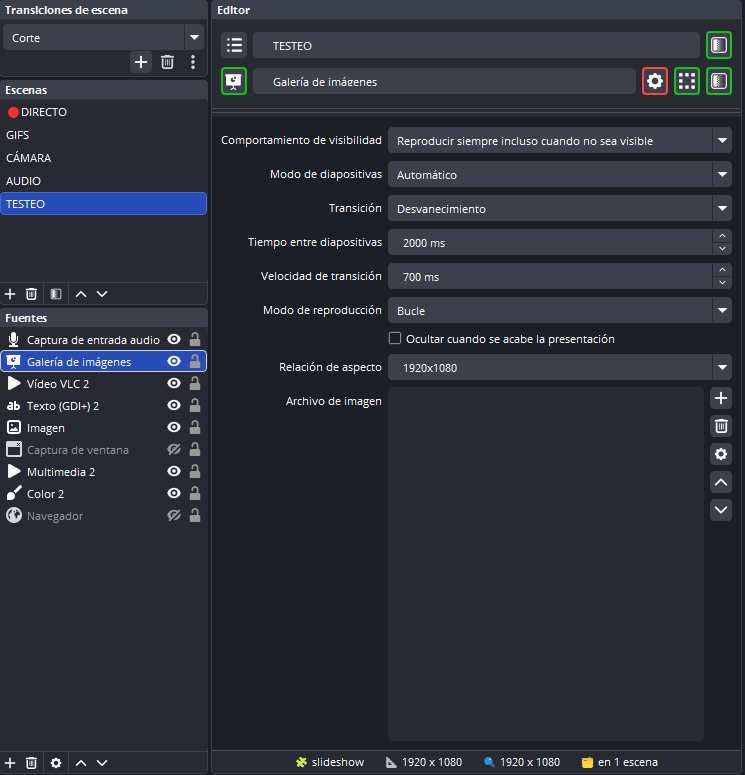
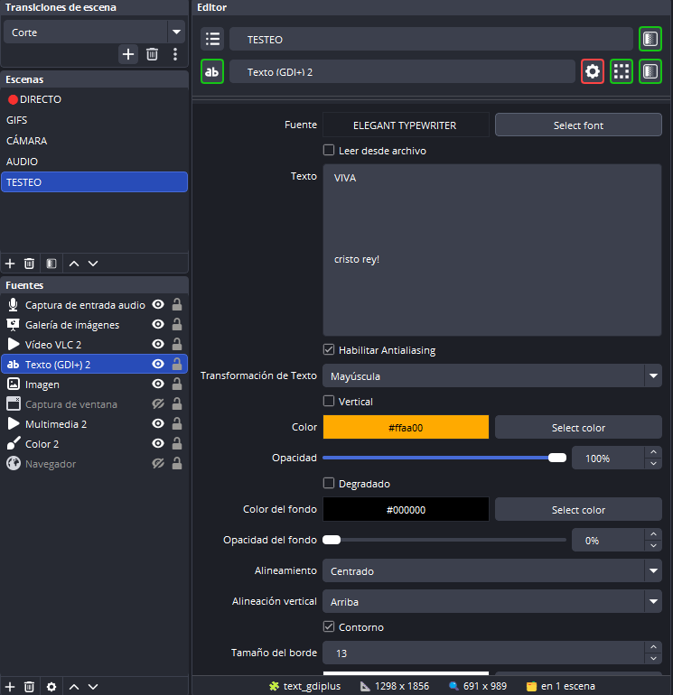
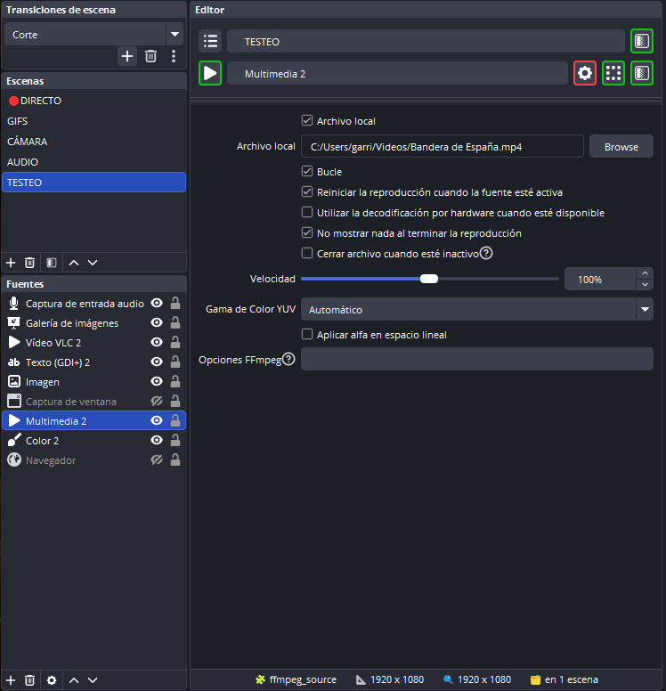
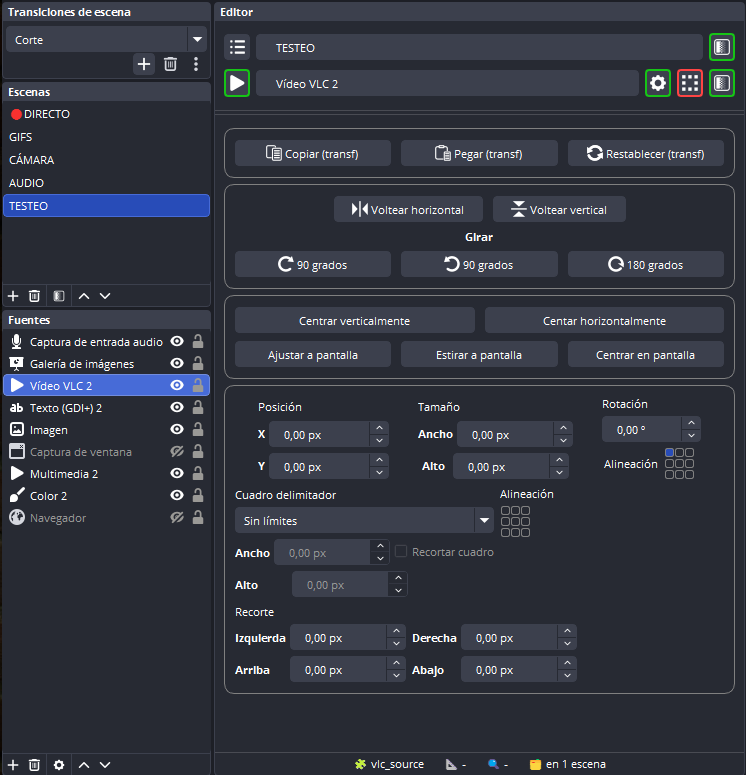
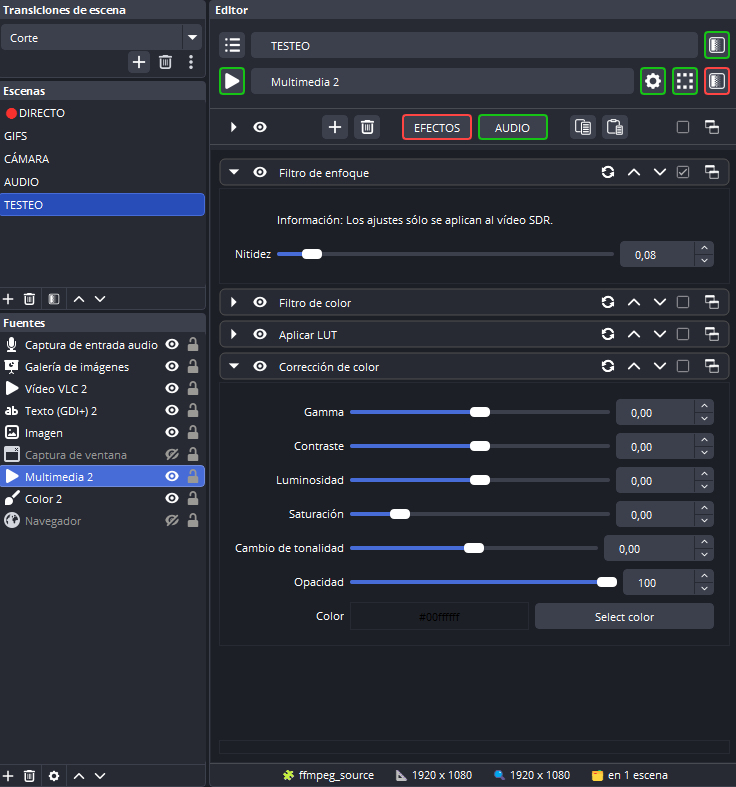
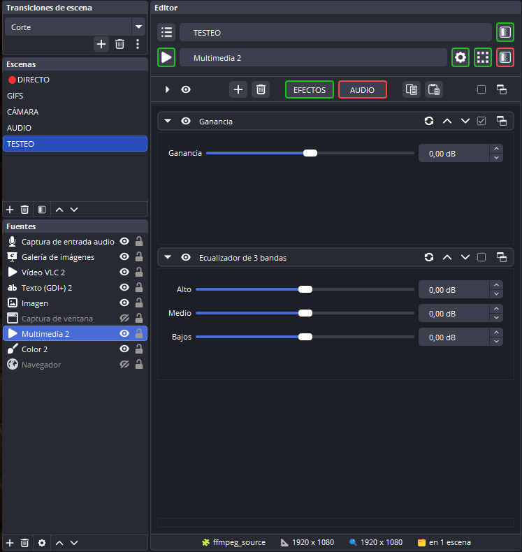
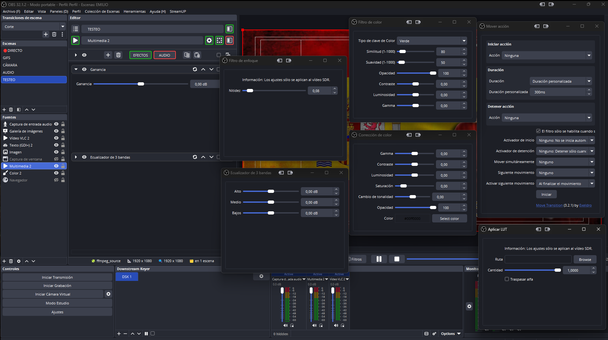

**A plugin for OBS that improves the editing workflow in both pre‑production and post‑production. It provides a unified dock with quick access to source properties, source and scene filters, transformations, and other tools to speed up scene editing.**

This dock reimagines the OBS interface so you don’t have to constantly open and close menus and windows, saving time while working on your projects.

Access to the panels is done through the header buttons, highlighted with a green border. The button representing the active panel is marked with a red border. You can also edit the name of the selected scene and source directly from the header.

---

## 🟢 SOURCE PANEL
Depending on the selected source, the panel automatically shows or hides the available actions.

### Common actions for all sources
- Copy, paste reference, and paste duplicate  
- Color labels for the selected source  

### Image‑specific actions
- Screenshot  
- Open source projector  
- Scale filter  
- Blend mode  
- Blend method  

### Video‑specific actions
- Deinterlacing  

### Show/Hide source transitions
- Transition properties  
- Copy and paste transition  

### Audio‑specific actions
- Mono / stereo mode  
- Balance control  
- Sync offset  
- Audio monitoring options  
- Audio track selection  

---

## 🟢 PROPERTIES PANEL
The properties panel shows exactly the same options offered by OBS, but integrated inside the dock to avoid opening floating windows.  
Properties update automatically when switching sources, with no need to close or reopen anything.

This panel respects the original OBS design, including:
- Property groups  
- Custom controls  
- Dynamic properties depending on the source type  
- Real‑time updates when modifying values  

### Key features
- Properties always displayed inside the dock, no external windows  
- Switching sources updates the panel instantly  
- Compatible with all standard OBS sources  
- Compatible with custom properties from external plugins  

---

## 🟢 TRANSFORMATION PANEL
The transformation panel allows you to modify the position, scale, rotation, alignment, and cropping of the selected source, all from the dock and without opening the native OBS menu or panel.

The goal is to offer fast, centralized control of the most commonly used adjustments during scene editing.

### Available controls
- Copy, paste, and reset transform  
- Flip horizontal and vertical  
- Rotate 90º right, 90º left, and 180º  
- Center vertically and horizontally  
- Fit to screen  
- Stretch to screen  
- Center on screen  
- Position X / Y  
- Rotation  
- Scale X / Y  
- Anchor point  
- Alignment  
- Bounding box size  
- Bounding box type (None, Stretch, Scale Inner, Scale Outer)  
- Crop (left, right, top, bottom)  

### Key features
- Automatic updates when switching sources  
- No popup windows  
- Values synchronized in real time with OBS  
- Compatible with all sources that support transformations  

---

## 🟢 FILTER PANELS
The dock includes two independent panels: **Source Filters** and **Scene Filters**.  
Both work just like OBS’s native filters, but integrated inside the dock with important improvements for fast editing.

These panels include their own header for precise filter editing:
- Icon to expand or collapse all filter properties  
- Icons to show or hide filters  
- Button to add filters  
- Button to delete selected filters  
- Two buttons to switch between **EFFECT** and **AUDIO** filters. If the selected source does not support audio filters, the button is disabled  
- Buttons to copy and paste selected filters  
- Checkbox to select or deselect all filters  
- Button to open all filters in independent windows  

Filters are displayed in a list with:
- Expand/collapse icon  
- Visibility icon  
- Filter name (editable)  
- Icons to move filters up and down  
- Selection checkbox  
- Button to open the filter in an external window (multi‑edit)  

When a filter is expanded, its properties appear directly below it, pushing the rest of the list downward.

### Key features
- Filter list always visible inside the dock  
- Integrated properties without popup windows  
- Direct filter renaming  
- Visibility synchronized with OBS  
- Button to open filters in independent windows  
- Automatic updates when switching sources or scenes  

---

## 🎨 CUSTOM ICONS
I designed and added icons for:
- Transformation panel  
- Copy  
- Paste  
- Reset  
- Flip horizontal  
- Flip vertical  
- Rotate 90º right  
- Rotate 90º left  
- Rotate 180º
- Popout  

## ⚠️ WARNING ⚠️
*The new icons change color only when OBS is restarted.*

---

## 📜 PERSONAL NOTE
This plugin is and will always be FREE. It’s my way of thanking the community for all the contributions from which I’ve learned so much in my projects.

**¡¡ARRIBA ESPAÑA Y LA HISPANIDAD!!**

**¡¡VIVA CRISTO REY!!**